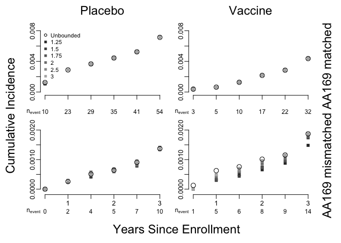

Introduction
------------

This document provides a short introduction to using the `survtmle`
package to compute bounded TMLE estimates of cumulative incidence.

Installation
------------

The version of survtmle used in the paper can be installed from GitHub as follows.

    # need the devtools package to install from GitHub
    library(devtools)

    # install survtmle from github
    install_github("benkeser/survtmle",ref="b7b3ccf0e01adc1cc958166ce5ccc0cc8aa9b5e9")

    # load survtmle
    library(survtmle)

Analysis of mock RV144 data
---------------------------

Included with the `survtmle` package is a mock RV144 data set that can
be used to "reproduce" the analysis in the paper.

    # load the rv144 data
    data(rv144)

    # look at the first 3 rows
    head(rv144)

    ##   ftime ftype vax male year04 year05 medRisk highRisk medAge highAge
    ## 1     6     0   0    1      1      0       1        0      0       0
    ## 2     6     0   1    1      0      0       1        0      1       0
    ## 3     6     0   1    1      0      1       1        0      0       0
    ## 4     6     0   0    0      1      0       0        0      0       1
    ## 5     3     0   0    0      0      1       0        1      1       0
    ## 6     6     0   1    1      0      1       1        0      0       1

The data are already in a format the is expected for the `survtmle`
function that will be called to compute estimates of cumulative
incidence. First, we call `survtmle` with no bounds to compute
unadjusted estimates of cumulative incidence in the placebo arm.

    # empty result holders
    est <- NULL
    rslt <- vector(mode="list",length=6)

    # get unbounded estimates at each time
    for(time in 1:6){
        tmp.fit <- survtmle(ftime=rv144$ftime,
                     ftype=rv144$ftype,
                     adjustVars=rv144[,c("highRisk","male","medRisk","medAge","highAge")],
                     trt=rv144$vax,
                     t0=time,
                     method="mean",
                     glm.ftime="highRisk + medRisk + highAge + medAge",
                     glm.ctime="highRisk + medRisk + highAge + medAge + t",
                     returnIC = FALSE, returnModels = FALSE)
        # store just the point estimates in est
        est <- cbind(est, tmp.fit$est)
        # store the whole fit in rslt
        rslt[[time]][[1]] <- tmp.fit
    }

We now write a small function to help us format a list of bounds to pass
to `survtmle`. We use this function to convert between bounds on the
cumulative incidence scale and bounds on the iterated mean scale.

    #' convertBounds
    #' 
    #' This function takes as input a list of length two with each entry a data.frame
    #' with named columns t and u1 (first entry) or u2 (second entry). The latter columns
    #' are the bounds specified on the conditional cumulative incidence scale. The function
    #' returns a list with two entries that contain the bounds on the iterated mean scale
    #' for the two endpoints of interest. 

    convertBounds <- function(bounds,t0){
      u1.tild <- (bounds[[1]]$u1[bounds[[1]]$t==t0])/(1 - c(0,bounds[[2]]$u2[1:t0]))
      u2.tild <- (bounds[[2]]$u2[bounds[[1]]$t==t0])/(1 - c(0,bounds[[1]]$u1[1:t0]))
      return(list(data.frame(t=1:t0,l1=0,u1=u1.tild[1:t0]),
                  data.frame(t=1:t0,l2=0,u2=u2.tild[1:t0])))
    }

We now call `survtmle` with bounds in a loop to obtain the bounded TMLE
results for different multipliers of the cumulative incidence in the
placebo arm.

    # loop over time
    for(time in 1:6){
        # each time create an empty list of 6 entries -- one for each bound multiplier
        rslt[[time]][[2]] <- vector(mode="list",length=6)
        # dummy counter
        ct <- 0
        # loop over bound multipliers
        for(m in c(1.25,1.5,1.75,2,2.5,3)){
            # add to counter
            ct <- ct + 1
            # make a list of bounds for this multiplier to be input into convertBounds
            # notice that these bounds are based on the cumulative incidence 
            # in the placebo arm from the unbounded tmles fit earlier
            bounds0 <- list(data.frame(t=1:6, l1=0, u1=est[1,]*m),
                            data.frame(t=1:6, l2=0, u2=est[3,]*m))
            # call convertBounds to put bounds on cumulative incidence scale
            boundsTime <- convertBounds(bounds=bounds0, t0=time)
            
            # call survtmle with this set of bounds for this time point
            tmp.fit <- survtmle(ftime=rv144$ftime,
                     ftype=rv144$ftype,
                     adjustVars=rv144[,c("highRisk","male","medRisk","medAge","highAge")],
                     trt=rv144$vax,
                     t0=time,
                     method="mean",
                     glm.ftime="highRisk + medRisk + highAge + medAge",
                     glm.ctime="highRisk + medRisk + highAge + medAge + t",
                     bounds=boundsTime,
                     returnIC = FALSE, returnModels = FALSE)
            # store results
            rslt[[time]][[2]][[ct]] <- tmp.fit
        } # end multiplier loop
    } # end time loop 

Plotting the results
--------------------

Below is the code that was used to produce the results figure.

    #-------------
    # formatting 
    #-------------
    # unbounded estimates
    est.ur <- NULL
    for(i in 1:6){
      est.ur <- rbind(est.ur, c(rslt[[i]][[1]]$est))
    }
    # bounded estimates
    est.r <- NULL
    for(m in 1:6){
      tmp <- NULL
      for(i in 1:6){
      tmp <- rbind(tmp, c(rslt[[i]][[2]][[m]]$est))
      }
      est.r <- cbind(est.r,tmp)
    }

    out <- data.frame(cbind(est.ur,est.r))
    names(out) <- c(
      paste0("f",c(0,1,0,1),c(1,1,2,2),".ur"),
      paste0("f",c(0,1,0,1),c(1,1,2,2),".r125"),
      paste0("f",c(0,1,0,1),c(1,1,2,2),".r150"),
      paste0("f",c(0,1,0,1),c(1,1,2,2),".r175"),
      paste0("f",c(0,1,0,1),c(1,1,2,2),".r200"),
      paste0("f",c(0,1,0,1),c(1,1,2,2),".r250"),
      paste0("f",c(0,1,0,1),c(1,1,2,2),".r300")
    )

    # set up plot and graph
    layout(matrix(c(1,2,3,4),nrow=2,byrow=TRUE))#,widths=c(1,1,0.25))
    par(oma=c(3.5,3.5,2,2))
    par(mar=c(2.5,1.5,1.5,1.5))
    mycol <- c(1, "gray20","gray30","gray40","gray50","gray60","gray70")
    mypch <- c(1,rep(15,6))
    mycex <- c(1.5, rep(1,6))

    # number of events for bottom of figure
    cntrlEvents <- apply(table(rv144$ftype,rv144$ftime,rv144$vax)[2:3,,1], 1, cumsum)
    vaxEvents <- apply(table(rv144$ftype,rv144$ftime,rv144$vax)[2:3,,2], 1, cumsum)
    ev01 <- cntrlEvents[,1]
    ev11 <- vaxEvents[,1]
    ev02 <- cntrlEvents[,2]
    ev12 <- vaxEvents[,2]

    for(f in c("01","11","02","12")){
      plot(x=rep(1,6),y=as.numeric(out[1,grep(paste0("f",f,".r"),colnames(out))]),
           pch=mypch[2:7],cex=mycex[2:7],
           ylim=c(-0.0001,ifelse(f %in% c("01","11"), 0.008, 0.002)),
           xlim=c(1,6),col=mycol[2:7],
           bty="n",xaxt="n",xlab="",ylab="",mgp=c(2.1,0.5,0))
      axis(side=1, at=1:6,labels=if(f %in% c("02","12")){
        c("","1","","2","","3")
        }else{
          rep("",6)
        },
        mgp=c(2.1,0.5,0))
      for(i in 2:6){
        points(x=rep(i,6),y=as.numeric(out[i,grep(paste0("f",f,".r"),colnames(out))]),
               pch=mypch[2:7],cex=mycex[2:7],ylim=c(0,0.01),xlim=c(1,6),col=mycol[2:7])
      }
      for(i in 1:6){
        points(x=i,y=as.numeric(out[i,grep(paste0("f",f,".ur"),colnames(out))]),
               pch=mypch[1],cex=mycex[1],col=mycol[1])
      }
      mtext(side=1,line=1.5,xpd=TRUE,outer=FALSE,at=1:6,
            eval(parse(text=paste0("ev",f))),cex=0.75)
      mtext(side=1,line=1.5,xpd=TRUE,outer=FALSE,at=0.5,
            expression(n[event]),cex=0.75)
      if(f=="01"){
        legend(x="topleft",pch=mypch,col=mycol,cex=0.85,
               bty="n",
               legend=c("Unbounded","1.25","1.5","1.75","2","2.5","3"))
      }
    }
    mtext(outer=TRUE,side=2,"Cumulative Incidence",line=1.5,cex=1.5)
    mtext(outer=TRUE,side=1,"Years Since Enrollment",line=1.5,cex=1.5)
    mtext(outer=TRUE,side=3,line=0,cex=1.5,at=0.25,"Placebo")
    mtext(outer=TRUE,side=3,line=0,cex=1.5,at=0.75,"Vaccine")
    mtext(outer=TRUE,side=4,line=0,cex=1.5,at=0.75,"AA169 matched")
    mtext(outer=TRUE,side=4,line=0,cex=1.5,at=0.25,"AA169 mismatched",
          srt=180)

